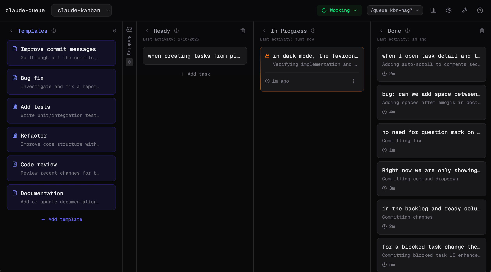

# claude-queue

Define your tasks in a task board and let Claude Code work through them one by one. It will move tasks through the workflow, ask for help when blocked, and commit changes when done.



## Quick Start

```bash
cd /path/to/your/project
npx claude-queue
```

This starts the queue server and opens your board at `http://localhost:3333` with the empty project board. You can start adding tasks that you want Claude to work on.

Get the project ID/command from the top right of the web UI (e.g. `kbn-xxxx`). Then in Claude Code run:

```
/queue <project-id>
```

Claude will start watching your board and work through tasks in the Ready column. It won't stop until there are no more Ready tasks.

## How It Works

- **Add tasks** to the Ready column in the web UI
- **Run `/queue`** in Claude Code
- **Claude picks up tasks**, moves them to In Progress, and works on them
- **If blocked**, Claude leaves a comment asking for your input, leave a reply comment to unblock
- **When done**, Claude commits changes and moves the task to Done
- **Repeat** until no more Ready tasks

## Planning Mode

Instead of manually adding tasks, you can describe a feature and let Claude break it down into tasks:

```
/queue plan <project-id>
```

Claude will guide you through the steps:

- Ask what you'd like to plan
- Propose a task breakdown based on your description
- Let you refine the tasks
- Ask whether to add them to Ready (default) or Backlog
- Create all tasks automatically

You can then ask claude to start working through the planned tasks or close the session and run `/queue <project-id>` in another session to start.

## Features

- **Sound notifications** — Audio alerts when tasks start, complete, or need attention (toggleable)
- **Keyboard shortcuts** — Press `?` to see all shortcuts (`N` to add task, `S` for stats, etc.)
- **Statistics** — Track completed tasks, time spent, and productivity metrics
- **Drag & drop** — Reorder tasks between columns

## CLI Commands

```bash
claude-queue              # Start server (foreground)
claude-queue --detach     # Start server (background)
claude-queue status       # Check if server is running
claude-queue stop         # Stop the server
claude-queue restart      # Restart the server
claude-queue list         # List all projects
claude-queue doctor       # Diagnose and fix issues
claude-queue upgrade      # Upgrade to latest version
claude-queue uninstall    # Remove MCP and skill config
claude-queue uninstall --all  # Also remove all data
```

## Upgrading

To upgrade to the latest version:

```bash
npx claude-queue upgrade
```

This updates the npm package, reinstalls the `/queue` skill with the latest version, and refreshes the MCP configuration. Restart Claude Code after upgrading.

## Development

```bash
git clone https://github.com/kamranahmedse/claude-queue.git
cd claude-queue
make setup    # Install deps, build, configure MCP
make dev      # Start dev server with hot reload
```

Use `/queue-dev` in Claude Code to connect to the dev server (port 3334).

## License

MIT © Kamran Ahmed
